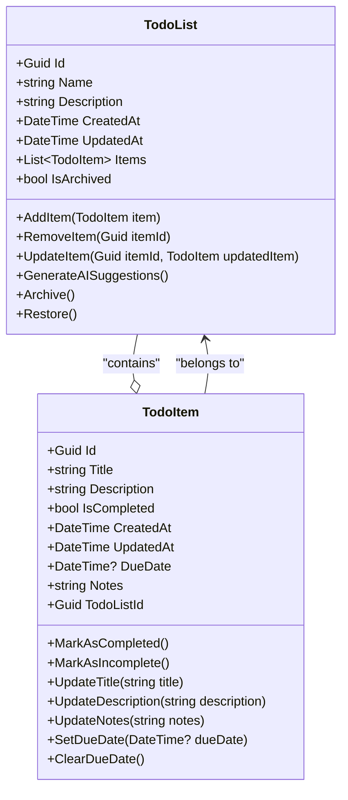
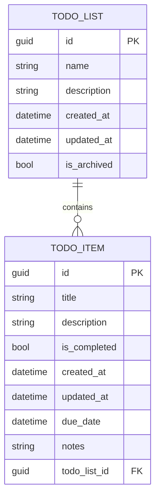
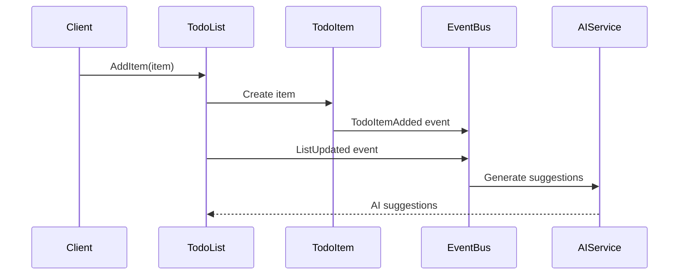

# Domain Objects Documentation

This document describes the core domain objects for the Aido application: **Todo List** and **Todo Item**.

## Overview

Aido is a todo/packing/checklist application that uses AI to generate suggestions. The core domain revolves around two primary entities that form an aggregate relationship.

## Core Domain Objects

### Todo List

A **Todo List** represents a collection of related todo items.

**Key Characteristics:**
- Acts as an aggregate root in DDD terms
- Contains metadata about the list (name, description, creation date)
- Manages a collection of todo items
- Provides AI context for generating suggestions

**Responsibilities:**
- Maintain list metadata and state
- Manage todo item lifecycle within the list
- Provide context for AI-powered suggestions
- Enforce business rules across contained items

### Todo Item

A **Todo Item** represents an individual task or item within a todo list.

**Key Characteristics:**
- Belongs to exactly one todo list
- Has completion status and priority
- Can have AI-generated suggestions
- May contain additional metadata (due date, notes)

**Responsibilities:**
- Track completion status
- Store item-specific metadata
- Maintain relationship with parent list
- Support AI suggestion functionality

## Domain Model



## Entity Relationships



## Domain Events

The domain objects raise events to support loose coupling and enable features like AI suggestions:



## Business Rules

### Todo List Rules
1. **Item Limits**: Maximum 1000 items per list
2. **Archive State**: Archived lists cannot be modified
3. **Name Requirements**: List names cannot be empty or whitespace only

### Todo Item Rules
1. **Parent Relationship**: Items must belong to exactly one list
2. **Completion Logic**: Completed items cannot have due dates in the past
3. **Title Requirements**: Item titles cannot be empty or whitespace only

## AI Integration Points

1. **List Analysis**: AI analyzes existing items to suggest new ones
2. **Completion Prediction**: AI predicts completion likelihood
3. **Smart Suggestions**: AI suggests relevant items based on list context

## Usage Examples

### Creating a Todo List
```csharp
var todoList = new TodoList(
    name: "Europe Vacation",
    description: "3-week Europe trip packing list"
);

var item = new TodoItem(
    title: "Passport",
    description: "Check expiration date",
    todoListId: todoList.Id
);

todoList.AddItem(item);
```

### Managing Item Completion
```csharp
var item = todoList.GetItem(itemId);
item.MarkAsCompleted();
```

This domain model provides a solid foundation for the Aido application while maintaining clean separation of concerns and supporting AI-enhanced functionality.